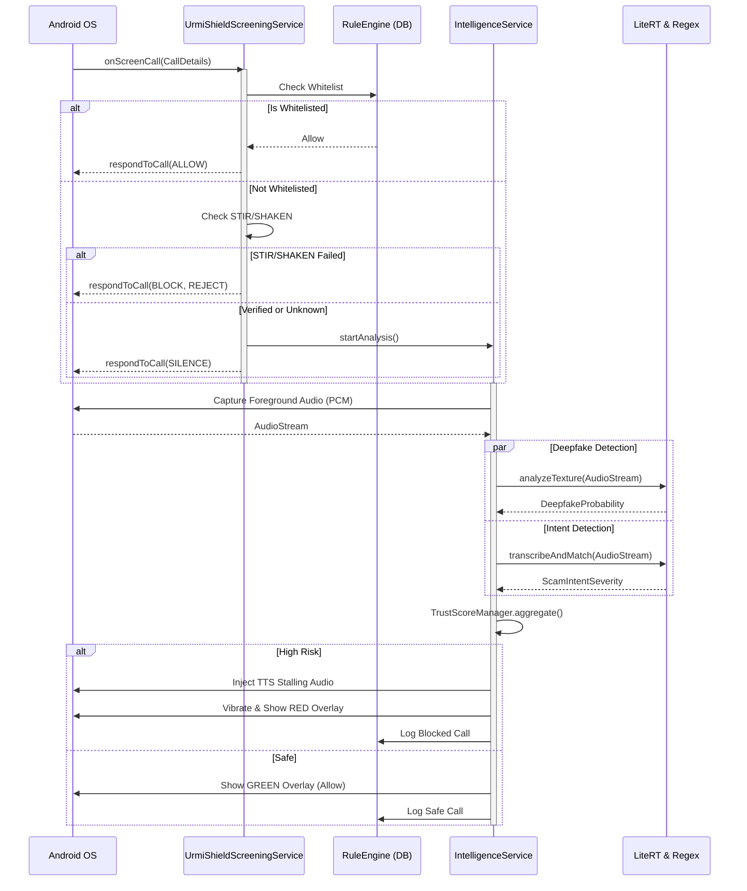

# Urmi Shield Architecture 🏗️

## High-Level Overview

Urmi Shield is a Clean Architecture Android application designed for high-performance call screening.

### Layers

1.  **UI Layer (Presentation)**
    -   **Jetpack Compose**: All UI is declarative.
    -   **Navigation**: Single Activity (`MainActivity`) with `NavHost`.
    -   **Screens**: `Dashboard`, `History`, `Settings`, `Onboarding`.

2.  **Service Layer (Domain/Logic)**
    -   **UrmiShieldScreeningService**: The entry point for call interception.
    -   **IntelligenceService**: The heavy lifter. Orchestrates Audio -> AI -> Defense.
    -   **RuleEngine**: Fast-path logic for Whitelist/Emergency bypass.

3.  **Data Layer (Repository)**
    -   **Room Database**: Stores `CallLogEntity` and `NumberListEntity`. Encrypted with SQLCipher.
    -   **DataStore**: Stores user preferences (`SettingsRepository`).
    -   **Worker**: Downloads updates (`ScamPatternWorker`).

4.  **AI Layer (Core)**
    -   **LiteRTClassifier**: TensorFlow Lite wrapper for deepfake detection.
    -   **SpeechRecognizerManager**: Wrapper around Android SpeechRecognizer.
    -   **ScamDetector**: Regex/Pattern matching engine.
    -   **TrustScoreManager**: The "Brain" that calculates risk.

## Data Flow Pipeline

The following diagram illustrates the zero-latency interception and parallel AI analysis pipeline that occurs entirely on-device when a call is received:

## Security Controls

-   **Zero-Network**: No upload code exists.
-   **Obfuscation**: AI logic is hidden via R8.
-   **Encryption**: DB is encrypted at rest.
-   **Permissions**: Least privilege; runtime requests only.
